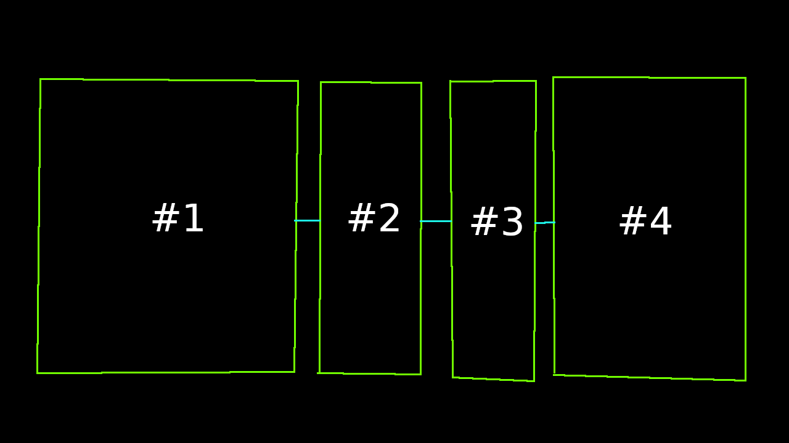

(This guide is under development.)

Heads up: **This guide uses pictures to illustrate some sections.** It is thus recommend to enable picture elements on your browser. If you can't do that, then download the assets so you can follow along easier (and also save bandwidth).

This is a guide dedicated to Mapmakers and Navmesh Developers. It is recommend to read the VDC Wiki entries on the [Navigation Mesh](https://developer.valvesoftware.com/wiki/Navigation_Meshes) and [`tf_bot`s](https://developer.valvesoftware.com/wiki/Tf_bot) as this guide assumes that you have some background knowledge and experience with Nav Meshes.

NOTE: The information presented in this guide is based off primitive reverse engineering, the 2018 Jungle Inferno code leak, 2013 Source SDK, and observations.

# Useful Commands

[General nav mesh commands.](https://developer.valvesoftware.com/wiki/Navigation_Mesh_Commands)

* `tf_show_mesh_decoration` - Shows all TFAttributes in nav areas.
* `tf_show_mesh_decoration_manual` - Shows all TFAttributes in nav areas *except* `BLUE_ONE_WAY_DOOR`, `RED_ONE_WAY_DOOR`, `TF_NAV_HAS_AMMO`, `TF_NAV_HAS_HEALTH`, and `TF_NAV_CONTROL_POINT`.

`tf_show_mesh_decoration_manual` is processed before `tf_show_mesh_decoration` in the game code.

* `tf_show_blocked_areas` - Shows areas blocked by a demographic (Purple for both teams, red for RED team, blue for BLU team). This is handy for debugging TF attribute logic.
* `tf_show_control_points` - Shows `TF_NAV_CONTROL_POINT` attributes that are directly under control points in yellow, and ones that are adjacent to a control point in dark yellow.
* `tf_show_incursion_flow` - Shows the paths that each team will take to get to their enemy's spawn room.
* `tf_show_sentry_danger` - Shows nav areas that are in range of sentries.

# TFAttributes

TF2 has specific attributes for Doors, RED and BLU teams, and control point logic. (I will call these TFAttributes for brevity.) These are:

1. `TF_NAV_UNBLOCKABLE` - Prevents an area from being blocked.
2. `TF_NAV_BLOCKED` and by proxy `BLOCKED_UNTIL_POINT_CAPTURE` and `BLOCKED_AFTER_POINT_CAPTURE`.
3. `BLUE_ONE_WAY_DOOR` - Blocks nav area for RED TFBots.
4. `RED_ONE_WAY_DOOR` - Blocks nav area for BLU(E) TFBots.
5. `NAV_MESH_NAV_BLOCKER` (from `func_nav_blocker`).
6. The internal blocked status made by the Source Engine itself.

* `DOOR_ALWAYS_BLOCKS` - Blocks nav area upon `func_door` being closed.
* `DOOR_NEVER_BLOCKS` - Prevents nav area from being blocked by `func_door`s.
* `SNIPER_SPOT` - Unused TFAttribute meant for the raid game mode. It was meant to mark areas to be utilized by snipers.
* `SENTRY_SPOT` - Unused TFAttribute meant for the raid game mode. It was meant to mark areas to build sentries at.

You may notice that I have listed TFAttributes in an ordered list, instead of an unordered list. This is intentional as **TFAttributes override each others' blocked status(es)**, so the ordered list represents the order the TFAttributes' blocked status is processed.

`DOOR_ALWAYS_BLOCKS` and `DOOR_NEVER_BLOCKS` are processed during nav mesh analysis, so they are not processed with the other TFAttributes.

# The Map and the Nav Mesh

## General

### Size
In Team Fortress 2, each nav area takes up at least 108 bytes. 108 bytes is a small amount of storage space, compared to the soon-to-be-common TB drives of today. Still it is a good idea to try to simplify nav areas to save on storage space, but the form and function should be prioritized.

**It is bad to *over*simplify nav areas** as all Source-Engine Games that use NAV Version 16, not just TF2, uses nav areas to determine where Demoman TFBots place sticky traps and areas that are visible to sentries. So nav areas should not be combined too much, so that the game can accurately determine what areas are visible to sentries.

### Encounter Paths

Do not bother with encounter paths, as they are not used in Team Fortress 2; they are only used in the Counter-Strike Series.

### Occupation Times

Do not bother with occupation times, as they are not used in Team Fortress 2; they are only used in the Counter-Strike Series.

## Walls

When creating nav areas that are close to walls, try not to push them up into the wall; leave spacing so TFBots don't try to walk into the wall.

## Spawn Rooms

TF2 automatically marks spawn rooms and spawn exits with attributes, so there is usually no need to mark them manually. However if there are spawn exits that have not been marked with `TF_NAV_SPAWN_ROOM_EXIT`, you can mark them with `BLUE_SETUP_GATE` or `RED_SETUP_GATE`.

Do not use the one-way team attributes (`BLUE_ONE_WAY_DOOR` and `RED_ONE_WAY_DOOR`) *alone* for spawn doors, as they do not account for setup time, and prevent the enemy team from entering regardless if the enemy team has won. Add an extra route for BLU team to ensure all bots can get to a destination.

## Ammunition and Health packs.

Ammo and Health packs should be contained in their own nav area, so that the bot is able to directly navigate to them, and they will be less likely to walk over them by accident.

Also add `func_nav_cost` entities to Ammo/Health pack areas, so that bots will actually *try* to avoid wasting them.

# Techniques

## Airstrafe Paths

You can get bots to airstrafe to a spot by organizing nav ares into a layout that I call an "Airstrafe Path".

(Nav Areas are marked by green squares, bidirectional connections are light blue, and monoconnections are blue.)

Bots at the starting point will presumably jump to the turning point, then turn towards the the destination once they hit the turning point nav area and will reach the destination.

It is recommended to keep the turning point area small so that bots don't try to move forward while turning.

Airstrafe paths don't have to be in this particular layout. For instance you can reverse the starting point and destination, add two destinations, use monodirectional connections instead of bidirectional connections, have multiple turning points, etc.

---

The technique of airstrafe paths can be applied to *any* navigation area, not just paths.

### How does this technique work?

Bots will always attempt to travel on a navigation area, regardless if they are grounded. (In the example airstrafe path, the bot is trying to move forward then turn left. When the airstrafe path is off the ground; the bot will move forward, then turn left, which results in the bot airstrafing to the left.)

Conveniently, airstrafes are done by turning left or right with forward motion. Since the bot can generate forward motion and turn left or right; the bot can technically airstrafe.

## Stacked Areas

There will be moments where you'll need multiple TFAttributes to get bots to work with some map logic, and **since TFAttributes actually *override* each others blocked statuses**, just applying all the TFAttribtues to one area won't work; a specific path of nav areas to setup bots for a jump. In these cases you often want to preserve the original nav area for full movement, **it is often a good idea in these cases to stack nav areas on top of other nav areas**.

 

Tip: `nav_shift`, `nav_corner_raise`, and `nav_corner_lower` will help you shift nav areas onto each other.

Example: You encounter a spawn door that opens when the 2nd point is capped and closes when 4th is capped.

In this case, nav area #1 is in the battleground, #2 and #3 are in the spawn door, and #4 is in the spawn room. Marking #2 or #3 *alone* would result in blocked-status collision from blocking priority, and as such will not work in this case.

Instead #2 should be marked with `BLOCKED_UNTIL_POINT_CAPTURE` and `WITH_SECOND_POINT`, and #3 with `BLOCKED_AFTER_POINT_CAPTURE` and `WITH_FOURTH_POINT`; This way the attributes will work properly with each other and will not try to override their blocked statuses.

However it is a good idea to move #2 and #3 into the same position, so that bots will not try to move in weird directions before getting to #1.

## Enforcing properties onto nav areas.

Through the use of `nav_save_selected` and `nav_merge_mesh`, it is possible to not only forcefully make connections, but also nav areas with custom shapes. This is possible due to these two commands using a file to store and retrive nav mesh data.

Some connections cannot be made, because the connection would go in a negative direction. This is for stability reasons, as these connections can cause crashes sometimes. However the nav mesh editor may still need that connection regardless.

Tip: `nav_shift`, `nav_corner_raise`, and `nav_corner_lower` will help you shift nav areas.

<!--Warning: Since the connection uses negative coordinates, the mesh may start to have issues.-->

# Testing a Nav mesh

Nav meshes need testing so that you can fix bugs in them and ensure they actually function, before releasing them or implementing the nav mesh into your map. ***Always* analyze the nav mesh before testing it, *unless* it is impossible to do so.** TFBots rely on the nav mesh for movement and visibility, so it is important to analyze it to get metadata. TFBots in unanalyzed meshes will be slower to react to enemies, due to mismatched mesh visibility data, and in general will not work as well.

## Test a specific path

Traditionally specific paths are tested through `bot_moveto` (or in CS:GO's case `bot_zombie 1` and `bot_goto_selected`) with a puppet bot. Unfortunately though, `bot_moveto` currently (as of August 2021) does not work in Team Fortress 2, so the next best alternative is to use opposite-team flags to get bots to move to a nav area.

To get bots to move to these paths, you will need to create a flag (entity [`item_teamflag`](https://developer.valvesoftware.com/wiki/Item_teamflag)) opposite to the TFBot's team.

Medic TFBots ignore the nav mesh when healing a patient, which can be useful when unable to use a navmesh, but **Medic TFBots are bad for testing specific paths as a result**.

<!-- The FAQ

# FAQ

## "What's the point of improving/making nav meshes when I can just use nav_generate?"

There's a reason you're reading this. **`nav_generate` does an okish, but not a good, job at creating a nav mesh**; `nav_generate` often generates biconnections where they shouldn't be, fails to account for all possible areas that players can reach, makes nav areas too close to walls, etc. These sorts of details can influence how well bots play TF2, and may in fact turn off a player from playing with bots.
-->
