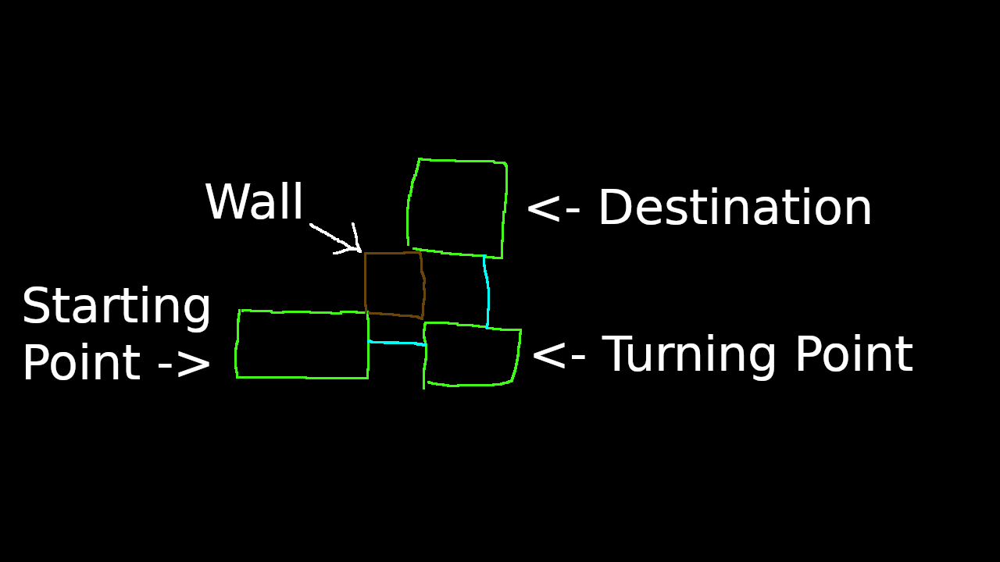

(This guide is under development.)

Heads up: **This guide uses pictures to illustrate some sections.** It is thus recommend to enable picture elements on your browser. If you can't do that, then download the assets so you can follow along easier (and also save bandwidth).

# TF2 Navmesh Development Guide

This is a guide dedicated to Mapmakers and Navmesh Developers. It is recommend to read the VDC Wiki entries on the [Navigation Mesh](https://developer.valvesoftware.com/wiki/Navigation_Meshes) and [`tf_bot`s](https://developer.valvesoftware.com/wiki/Tf_bot) as this guide assumes that you have some background knowledge and experience with Nav Meshes.

## Useful Commands

* `tf_show_mesh_decoration` - Shows all TFAttributes in nav areas.
* `tf_show_mesh_decoration_manual` - Shows all TFAttributes in nav areas *except* `BLUE_ONE_WAY_DOOR`, `RED_ONE_WAY_DOOR`, `TF_NAV_HAS_AMMO`, `TF_NAV_HAS_HEALTH`, and `TF_NAV_CONTROL_POINT`.
`tf_show_mesh_decoration_manual` is processed before `tf_show_mesh_decoration` in the game code.

* `tf_show_blocked_areas` - Shows areas blocked by a demographic (Purple for both teams, red for RED team, blue for BLU team). This is handy for debugging TF attribute logic.
* `tf_show_control_points` - Shows `TF_NAV_CONTROL_POINT` attributes that are directly under control points in yellow, and ones that are adjacent to a control point in dark yellow.
* `tf_show_sentry_danger` - Shows nav areas that are in range of sentries.

## TFAttributes

TF2 has specific attributes for Doors, RED and BLU teams, and control point logic. These are:

1. `TF_NAV_UNBLOCKABLE` - Prevents an area from being blocked.
2. `TF_NAV_BLOCKED` and by proxy `BLOCKED_UNTIL_POINT_CAPTURE` and `BLOCKED_AFTER_POINT_CAPTURE`.
3. `BLUE_ONE_WAY_DOOR` - Blocks nav area for RED TFBots.
4. `RED_ONE_WAY_DOOR` - Blocks nav area for BLU(E) TFBots.
5. `NAV_MESH_NAV_BLOCKER` (from `func_nav_blocker`).
6. The internal blocked status made by the Source Engine itself.

* `DOOR_ALWAYS_BLOCKS` - Blocks nav area upon `func_door` being closed.
* `DOOR_NEVER_BLOCKS` - Prevents nav area from being blocked by `func_door`s.

You may notice that I have listed TFAttributes in an ordered list, instead of an unordered list. This is intentional as **TFAttributes override each others' blocked status(es)**, so the ordered list represents the order the TFAttributes' blocked status is processed.

`DOOR_ALWAYS_BLOCKS` and `DOOR_NEVER_BLOCKS` are processed during nav mesh analysis, so they are not processed with the other TFAttributes.

## The Mesh

### General

Each nav area takes up 768 bytes. 768 bytes is a small amount of storage space today, so while it is a good idea to try to simplify nav areas to save on storage space, 

**It is bad to oversimplify nav areas** as TF2 uses nav areas to determine where Demoman TFBots place sticky traps and areas that have sentries in range. So nav areas

### Walls

When creating nav areas that are close to walls, try not to push them up into the wall; leave spacing so TFBots don't try to walk into the wall.

### Spawn Rooms

TF2 automatically marks spawn rooms and spawn exits with attributes. Alternatively if there are spawn exits that have not been marked with `TF_NAV_SPAWN_ROOM_EXIT`, you can mark them with `BLUE_SETUP_GATE` or `RED_SETUP_GATE`.

Do not use the one-way team attributes (`BLUE_ONE_WAY_DOOR` and `RED_ONE_WAY_DOOR`) for spawn doors, as they do not account for setup time.

## Techniques

### Airstrafe Paths

You can get bots to airstrafe to a spot by organizing nav ares into a layout that I call an "Airstrafe Path".

(Nav Areas are marked by green squares, bidirectional connections are light blue, and monoconnections are blue.)

Bots at the starting point will presumably jump to the turning point, then turn towards the the destination once they hit the turning point nav area and will reach the destination.

Airstrafe paths don't have to be in this particular layout. For instance you can reverse the starting point and destination, add two destinations, use monodirectional connections instead of bidirectional connections, etc.

### Stacked Areas

There will be moments where you'll need multiple TFAttributes to get bots to work with some map logic, or a specific path of nav areas to setup bots for a jump. **Since TFAttributes actually *override* each others blocked status**, and you often want to preserve the original nav area for full movement, **it is often a good idea to stack nav areas on top of other nav areas**.

 

Tip: `nav_splice`, `nav_shift`, `nav_corner_raise`, and `nav_corner_lower` will help you shift nav areas onto each other.

## Testing a Nav mesh

Navmeshes need testing so that you can fix bugs in them and ensure they actually function, before releasing them or implementing the nav mesh into your map. ***Always*** analyze the nav mesh before testing it, *unless* it is impossible to do so. TFBots rely on the nav mesh for movement and visibility, so it is important to analyze it to get meta datae. TFBots in unanalyzed meshes will be slower to react to enemies.

### Test a specific path

Traditionally specific paths are tested through `bot_moveto` (or in CS:GO's case `bot_zombie 1` and `bot_goto_selected`) with a puppet bot. Unfortunately though, `bot_moveto` currently (as of August 2021) does not work in Team Fortress 2, so the next best alternative is to use opposite-team flags to get bots to move to a nav area.

To get bots to move to these paths, you will need to create a flag (entity [`item_teamflag`](https://developer.valvesoftware.com/wiki/Item_teamflag)) opposite to the TFBot's team.

Medic TFBots ignore the nav mesh when healing a patient, which can be useful when unable to use a navmesh, but **Medic TFBots are bad for testing specific paths as a result**.

<!-- The FAQ

## FAQ

### "What's the point of improving/making nav meshes when I can just use nav_generate?"

There's a reason you're reading this. `nav_generate` does an okish, but not a good, job at creating a nav mesh; `nav_generate` often generates biconnections where they shouldn't be, fails to account for all possible areas that players can reach, makes nav areas too close to walls, etc. These sorts of details can influence how well bots play TF2, and may in fact turn off a player from playing with bots.
-->

Checksum: <!-- Insert checksum here. -->
